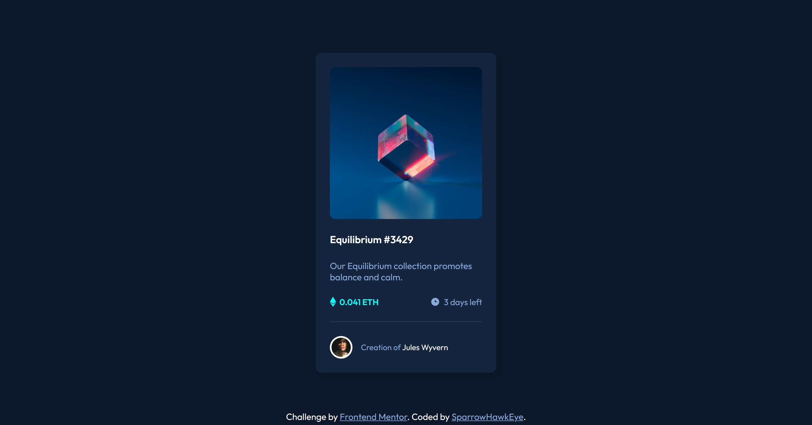
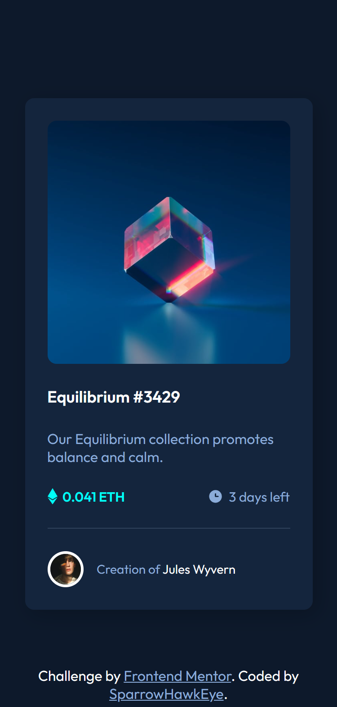

# Frontend Mentor - NFT preview card component solution

This is a solution to the [NFT preview card component challenge on Frontend Mentor](https://www.frontendmentor.io/challenges/nft-preview-card-component-SbdUL_w0U). Frontend Mentor challenges help you improve your coding skills by building realistic projects.

## Table of contents

- [Frontend Mentor - NFT preview card component solution](#frontend-mentor---nft-preview-card-component-solution)
  - [Table of contents](#table-of-contents)
  - [Overview](#overview)
    - [The challenge](#the-challenge)
    - [Screenshot](#screenshot)
    - [Links](#links)
    - [Built with](#built-with)
    - [What I learned](#what-i-learned)
    - [Useful resources](#useful-resources)
  - [Author](#author)

## Overview

### The challenge

Users should be able to:

- View the optimal layout depending on their device's screen size
- See hover states for interactive elements

### Screenshot

- Desktop View: 
- Mobile View: 

### Links

- Solution URL: [Add solution URL here](https://your-solution-url.com)
- Live Site URL: [Add live site URL here](https://your-live-site-url.com)
-

### Built with

- Semantic HTML5 markup
- CSS custom properties
- Flexbox
- CSS Grid

### What I learned

This Project help me to learn about overlay effect on hovering image.

### Useful resources

- [w3schools](https://www.w3schools.com/howto/howto_css_image_overlay_icon.asp) - This helped me for image overlay. I really liked this pattern and will use it going forward.

## Author

- Website - [SparrowHawkEye](https://sparrowhawkeye-dev.web.app/)
- Frontend Mentor - [@SparrowHawkEye](https://www.frontendmentor.io/profile/SparrowHawkEye)
- Twitter - [@SparrowHawk_Eye](https://twitter.com/SparrowHawk_Eye)
